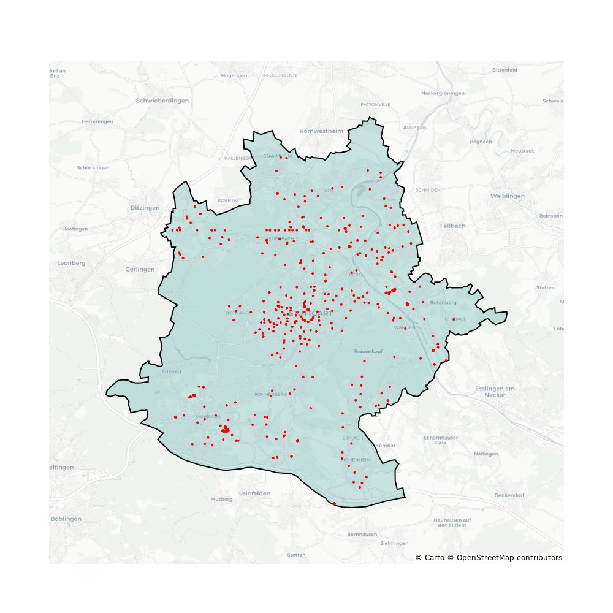
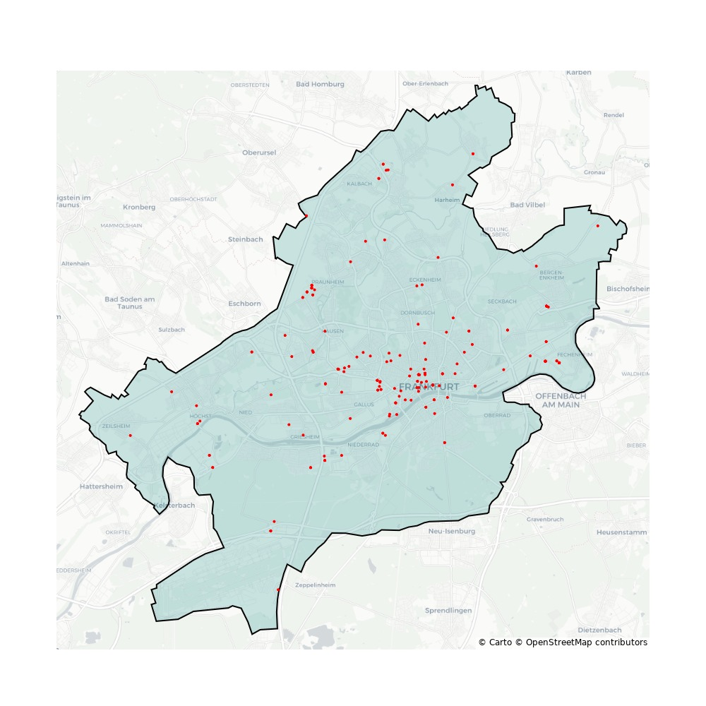
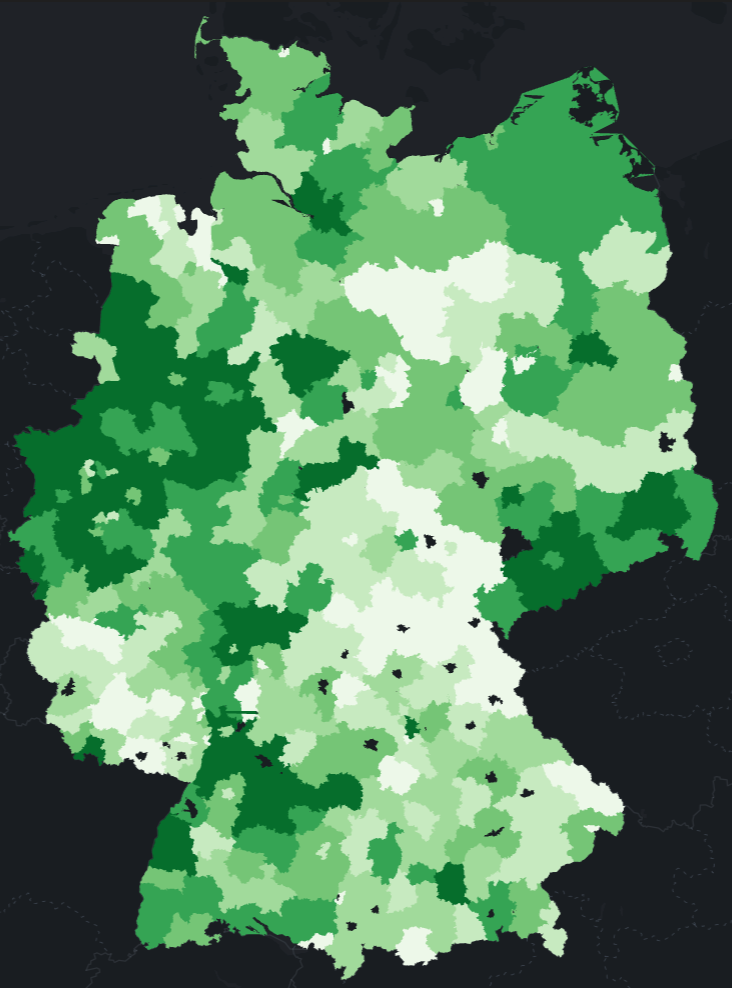
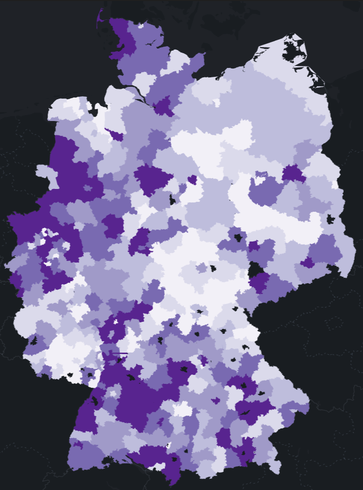
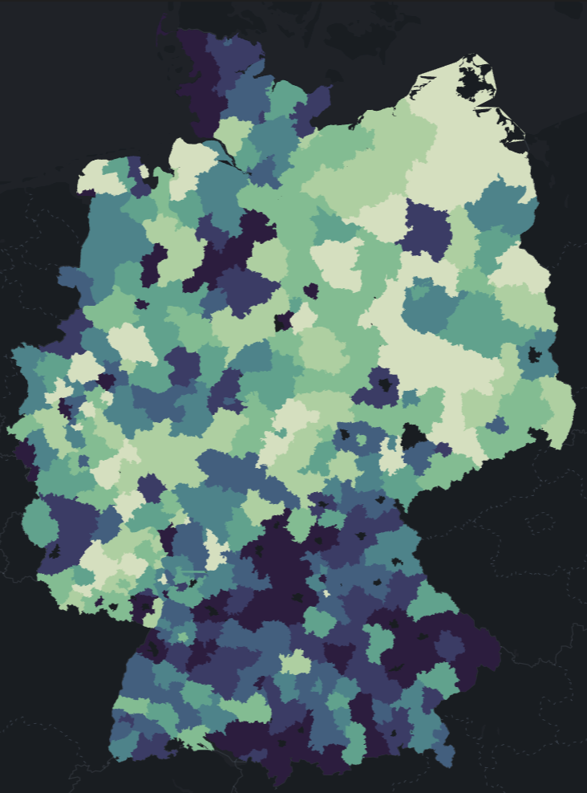

## Introduction
- A major part of energy system transformation is the transition of personal transport towards electric vehicles (EV)
- Meanwhile this faces a classical chicken or egg problem as market acceptance is based on available (public) charging infrastructure while efficient allocation of resccources to those infrastructure depends on enough users 
- In Germany a great part of the populations have not the possiblity to install private charging devieces.
- Lots of people dont life in houses with carport or garages and even if a major share does not own their living property
- For making EV a viable alternative germany needs enough public charging stations

## Charging infrastructure in germany
- Gouverment see privat sector in charge to invest
- at the moment about 80 to 90 thousand charging points
- goal is 1 million until 2030 
- Therefore the gouverment provides financial support for investors 

<-image here->
## Growing demand
- As this report by Roland Berger points out: While the energy transition proceeds more and more electric cars are on the roads 
- See image: The European light EV fleet should grow by 34% per year until 2050, reaching 227 million vehicles
- At the same time numerous competitors try to find valubale business models to to match the growing demand of public infrastructure.
- the main problem is here that EV drivers are (yet) highly unpredictable in their charging behaviors
- The profitablity of charging stations depends highly on workload which is uneaven distributed 
- Workload of german chargign stations is tracked in real time by the [Leitstelle Ladeinfrastruktur](https://nationale-leitstelle.de/verstehen/) (Charging infrastructure control centre) and ranges usually betwen 5% and 15%

<-diagram here->
## How to match the demand
- for eficient ressource allocation well informed location determination is crucial
- therefore we need:
    + Predict the regional demand of public charging infrastructure based on:
        - available charging stations
        - private charging opportunities
        - amount of cars
        - traveled distances
        - consumption per distance

    + Predict usage behavior of different charger types based on small area factors:
        - Traffic routes
        - Traffic volatility
        - length of stay
        - housing structure
        - periodic fluctuations

## Predicting Regional Demand

- The ladestation-api  provided by the german gouvernment provides at the moment 46,196 stations which is not the full sample but will be enough to provide major insight
- differences become clear when we look at two cities which are in the same regional context but show completly different patterns
- while in Stuttgart aproximatly 750 charging stations  available for there 600k inhabitants Frankfurt have only 222 for 750k citizen

