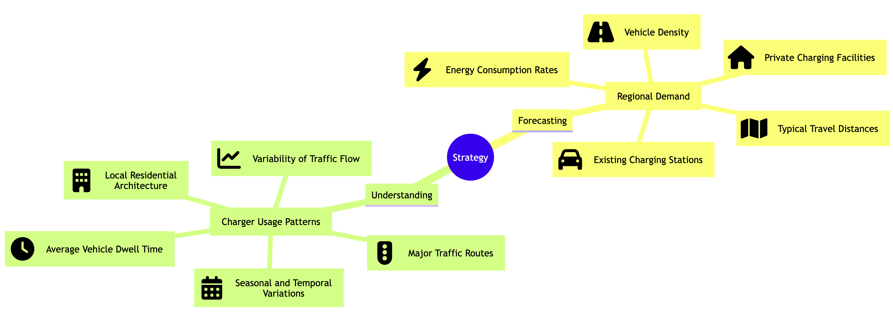

# Introduction

As we move towards a more sustainable energy future, the shift from traditional modes of personal transport to electric vehicles (EVs) is crucial. This transition is caught in a classic conundrum: the public's willingness to adopt EVs depends on the availability of public charging stations, but the strategic placement and resource allocation of these stations depends on a sufficient number of EV users. In Germany, the challenge is compounded by housing conditions. A significant proportion of the population doesn't have the option of installing private charging units due to lack of ownership or suitable facilities such as carports and garages. As a result, the availability of public charging stations is critical to making EVs a practical choice for the German population.

## Government subsidy

The German government envisages a leading role for the private sector in the development of EV charging infrastructure. Germany currently has an estimated 80,000 to 90,000 public charging points. To accelerate the transition to electric mobility, there is a national target to increase this number to [1 million by 2030](https://www.bundesregierung.de/breg-de/suche/ladepunkte-in-deutschland-1884666). To encourage this substantial investment, financial incentives are available to potential investors. More information on government programmes can be found [here](https://www.bundesregierung.de/breg-de/suche/ladepunkte-in-deutschland-1884666).

## Escalating demand and adaptation challenges

As Roland Berger's insightful report shows, the drive towards energy transition is translating into an increasing number of electric vehicles on Europe's roads. In particular, the European fleet of light electric vehicles is expected to grow robustly - by around 34% per year - to reach 227 million vehicles by 2050.

Against this backdrop, many companies are racing to develop sustainable business models to meet the growing demand for public charging stations. However, there's a bottleneck: the charging behaviour of EV users remains largely unpredictable. This variability poses a challenge to the profitability of charging stations, which is closely linked to their [utilisation](https://doi.org/10.3390/wevj8040936).

Current monitoring by the Charging Infrastructure Control Centre ([Leitstelle Ladeinfrastruktur](https://nationale-leitstelle.de/verstehen/)) shows that station utilisation is inconsistent, typically between 5% and 15%. This inconsistency further complicates the task of adequately meeting growing demand, and further research would be highly beneficial in bridging this gap. Your expertise in analytics could provide an invaluable perspective on how to effectively address this issue.

## Strategies for matching supply and demand

To allocate resources effectively, it's essential to make informed decisions about station locations. The following two core forecasting analyses can help make informed decisions:

1. **Forecasting regional demand:** To effectively meet local needs, a composite model that takes into account various factors can be invaluable. Key metrics for this model could include

    - Existing charging stations
    - Vehicle density
    - Availability of private charging facilities
    - Typical travel distances
    - Energy consumption rates per distance travelled

2. **Understanding charger usage patterns:** Different types of chargers can have different usage patterns, influenced by local conditions. To build a more adaptive network, consider factors such as

    - Major traffic routes
    - Variability of traffic flow
    - Average vehicle dwell time
    - Local residential architecture
    - Seasonal and temporal variations

By incorporating these elements, we can not only predict where new stations are most needed, but also tailor the types of charging options to the unique characteristics of each location. Feel free to explore these strategies further; your insights could make all the difference.

## Assessing the current state of charging infrastructure

The German government's [Ladestation API](https://github.com/bundesAPI/ladestationen-api) currently lists 46,196 charging stations. While this isn't a comprehensive inventory, it provides enough data for meaningful analysis. An interesting case study emerges when comparing two cities within the same regional context: Stuttgart and Frankfurt. Despite having similar populations, Stuttgart has approximately 750 charging stations for its 600,000 inhabitants, while Frankfurt has a much lower number of 222 stations for its 750,000 inhabitants.

On a national scale, the disparities remain. If we focus on Germany's 401 administrative districts (Landkreise), certain regional patterns emerge. In particular, Bavaria, Baden-Württemberg and selected parts of northern Germany perform better, with fewer than 1,400 inhabitants per public charging station. In contrast, many regions in eastern and western Germany have more than 3,000 inhabitants per station.

These geographical differences invite further analysis and highlight the need for targeted investment. Examining these differences can serve as a springboard for more nuanced policy recommendations. Feel invited to delve into these intriguing variations; your analytical eye may reveal key insights.

## Regional demand for charging infrastructure

Forecasting demand for electric vehicle (EV) charging stations requires a comprehensive look at the existing EV landscape. Recent data from the Kraftfahrtbundesamt (German Federal Motor Transport Authority) as of July 2023 shows disparities in the distribution of registered EVs across Germany. The eastern regions, for example, lag far behind in terms of EV ownership, suggesting that additional charging stations may not be urgently needed there.

This observation is further supported when looking at the ratio of EVs to charging stations. In most eastern and southern regions, fewer than 20 vehicles share each public charging station. In contrast, in some areas of western Germany, demand is much higher, with between 37 and 142 cars sharing a single public charging station.

These findings underscore the need for a nuanced approach to infrastructure investment, driven by the real-world behaviours and needs of EV users. We welcome your feedback and insights on this evolving landscape, which can only enrich the ongoing discussion.

## Findings and next steps

Our initial analysis shows that the need for investment in charging infrastructure doesn't just depend on the number of stations available, but also on where they are really needed. We've made a first foray into understanding the distribution of public electric charging points across Germany.

To refine an investment strategy focused on high impact locations, we can extend our research in several directions:

1. We can delve further into regional specifics, taking into account variables such as

    - Opportunities for private charging
    - Commuting distances
    - Energy consumption rates

2. We can also include more comprehensive data on the number of EVs, either using official models or developing our own based on registration trends and economic signals.

3. Finally, as mentioned earlier, the study of small area effects opens up avenues for more granular insights.

Methods such as small area estimation can be used here.
The use of real-time or historical usage data, where available, could be instrumental.
Advanced econometric techniques offer a robust way to reliably predict location-specific effects.
We look forward to taking this research forward and welcome your thoughts and contributions to this evolving topic.

